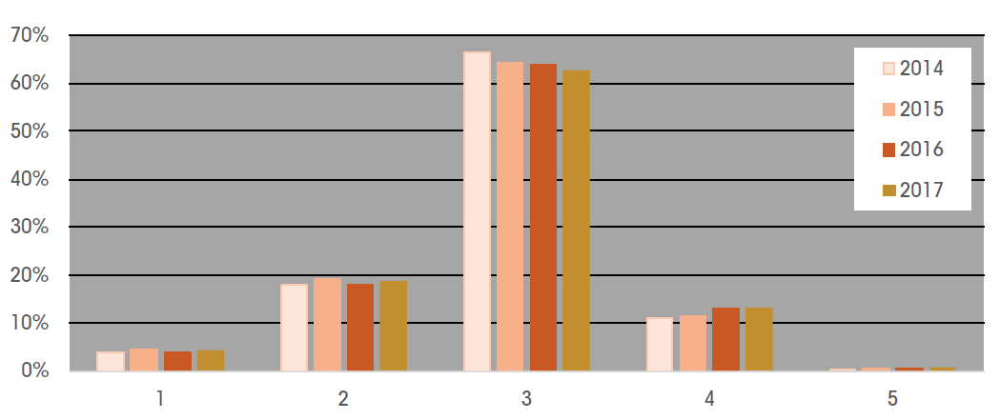
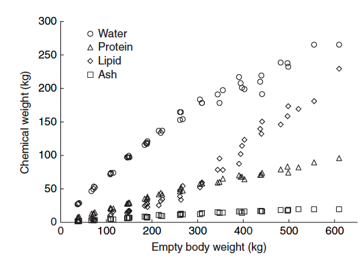

```{r setup, include=FALSE}
knitr::opts_chunk$set(echo = TRUE)
```


## Background

Up until summer 2018, the Swiss beef cattle breeders association has been focusing their genetic evaluations mainly on growth rate and carcass conformation. 
Lately it has been observed that carcass fat is decreasing at least for some beef cattle breeds, which leads to a price reduction of the carcass [@Hospenthal2016].

```{r, echo=FALSE, fig.cap = "Vergleich der Fettklasse 2014 - 2017"}


```


Several stakeholders derive from the decreasing levels of carcass fat that Swiss beef cattle does not show any improvements in the trait early maturity. 

Protein deposition increases linearly with increasing body weight, but lipid deposition increases exponentially with increasing body weight (Figure 21.3 Thonney) [@Thonney2015].

```{r, echo=FALSE, fig.cap = "Chemical components in the empty body (gut contents removed) of 49 beef steers. (From the data of Haecker, 1920.) [@Thonney2015]"}


```


Until 300 kg body weight the weight of protein is higher, then the weight of lipids is higher [@Thonney2015].
The heavier the animal the higher the proportion of fat tissue in comparison to muscle tissue and bone tissue [@Thonney2015].
Fat deposition is therefore usually the limiting factor for early maturity during growth [@Thonney2015].

Early maturity is of high economical importance because a lower age at slaughter leads to less costs for the farmer and less negative impacts on the environment [@Berry2017] (decreased feed and environment efficiency).

[@Strasser2017]

```
Bitte hier Begründung, weshalb die obige Beobachtung und somit die Frühreife wichtig sind
```

### Early maturity
Terms rooting on the word mature can be confusing. 
The "rate of maturation" describes the amount of time until the adult weight is reached and the "degree of maturity" describes the proportion of the current weight to the adult weight [@Thonney2015]. 
This would lead to the definition used in trout breeding that early maturity is the amount of time until the adult weight is reached [@Kause2014].

Early maturity ("Frühreife") in this context however is defined as the amount of time until an animal meets the necessary requirements (within its category?) to be slaughtered without any price reductions per kg of carcass weight. 

```
Referenz auf andere Defintionen ==> Literatur
```

### CHTAX

Price reductions are dependent on the price formation process of the slaughterhouse.

Since 1994 Swiss slaughterhouses value beef cattle based on the classification system CHTAX [Kaufmann1995]. 
The first step of valuation is placing the animal in the correct category. The distinct categories differ in physiological age at slaughter, sex and weight. 
Within each category the animal is visually classified in five classes of carcass fat (Tabelle) and carcass conformation (Bild).
When the animal does not belong to the optimal class of carcass fat (3) or the maximal class of carcass conformation (C) the price per carcass weight is reduced.

### Pricing
```{r, echo=FALSE, results='hide'}
Gewicht <- 200
C3 <- 9.55
H4 <- 7.9 - 0.9
ErloesC3<-Gewicht * C3
ErloesH4<- Gewicht * H4
```


For example the price of a young bull (MT) of `r Gewicht` kg carcass weight is `r ErloesC3`.- Swiss Francs (SFr) when in the most favoured classes of carcass conformation and carcass fat and `r ErloesH4`.- SFr when in the least favoured classes [@Proviande2018]. 


### Meat quality indicators

Carcass fat and carcass conformation have been introduced as price formation factors, because they coincide with important price-determining characteristics of beef meat [@Kaufmann1995]. 
Carcass fat when to low is related to poor tenderness, juiciness and palatability, when too high with increased trimming effort for the slaughterhouse[@Kaufmann1995].

A better carcass conformation in turn leads to a high exploitation of valuable meat pieces [@Proviande2015].

### Breeding strategy

In Summer 2018 carcass fat has joined carcass conformation and carcass weight to the existing multi-trait breeding valuation model carcass caracteristics.
The first results of the routine breeding value estimation for carcass fat have been published in summer 2018.
At the moment the trait carcass fat is used to derive the trait early maturity [@Kunz2018].


# Annex

Also there is the breed Limousin which underperforms in carcass fat. 
Nevertheless offspring of Limousin sires are most prevalent in the favoured category of carcass conformation C3. 
This shows that for breeding you should always combine the two traits carcass conformation and carcass fat [@Hospenthal2016]. 

Commercial cattle are generally determined as ready for slaughter by visual inspection of the degree of fatness within the appropriate range of live weight [@VanGroningen2006].

Carcass conformation correlates with carcass fat by about 0.31. 
Age at slaughter correlates positiveley with carcass fat but not linear (concave with decreasing slope) [@Hospenthal2016].

The proportion of weight to adult body weight (asymptotic weight) is degree of maturity [@Thonney2015].

The older the animal the higher the proportion of fat tissue in comparison to muscle tissue and bone tissue [@Thonney2015].

Most selection for growth changed the growth curve by decreasing or increasing adult size. 
Selection rareley changed the shape of the growth curve or the underlying biological relationships between growth and body composition [@Thonney2015].

Weights across different ages are highly correlated. Growth rates at given age are generally related to adult size [@Thonney2015].

The higher the age at slaughter of an animal is the higher is the impact of genetics on the beef carcass traits [@Englishby2017].

In Ireland the usually cross crossbred suckler cows to purebred beef sires. 
Also they use an multi-trait across breed animal model. There they include 15 traits including carcass weight and carcass fat. 
The heritability is 0.31 for carcass fat [@Evans2007].

In Switzerland the "Bundesamt für Landwirtschaft" has to determine the methods to classify carcasses of ruminants. 
The criteria are the age at slaughter, the carcass conformation and the carcass fat [@Bundesrat2002].

In order to get no selling price reductions they have to feed their animals for a longer time, when their animals do not mature early. 
However, in Switzerland the carcass should not weight too much. More than 290 kg carcass weight for MT will result in a price discount of at least 0.1.-/kg carcass weight [@Proviande2018].

### CHTAX

The beef meat market in Switzerland is controlled by the sector association "Proviande". Proviande employees classify beef carcasses in large-scale slaughterhouses to determine their price. 
Their classification is based on the classification system CH-TAX [@Proviande2015] and is carried out as follows:

1. The category of the carcass is defined by physiological age at slaughter, sex and carcass weight (Own table according to table on page 5, Proviande2015). 
When weighted the carcass should be already trimmed as shown in this figure [@EDI2013, S.1].

2. The carcass is visually classified for carcass conformation and carcass fat. 
Carcass conformation describes how meaty the carcass is and carcass fat describes how fat the carcass is.

3. The price of the carcass is estimated. For carcass conformation the price is maximal at the end of the scale (C) and for carcass fat at the center of the scale (3).

In Switzerland beef carcasses are generally much smaller than abroad in order to fulfill the wishes of the market. 
Therefore beef cattle in Switzerland has to mature earlier than abroad [@Hospenthal2016]. 

## Rate of maturation derived from carcass fat (Noch nicht überarbeitet)

Early maturity is a complex and not directly measurable trait which complicates breeding for it. 
One possibility is to derive this trait from an already recorded closely correlated trait. 

Carcass fat has been chosen because of two reasons. 
First it is being routineley collected in slaughterhouses since 1994 [@Kaufmann1995]. 
Second correlation is given by the fact that "cattle growth and body composition are inextricably linked" [@Thonney2015]. 
Protein increases linearly with increasing body weight, but lipid deposition increases exponentially with increasing body weight (Figure 21.3 Thonney) [@Thonney2015].
Until 300 kg body weight the deposition of protein is higher, then the deposition of lipids is higher [@Thonney2015].
This shows that over time carcass fat is generally the limiting factor to meet the requirements to be slaughtered.

Generally cattle gain weight as slightly sigmoid shaped curve (Fig. 21.1) which means that the weight gain is decreasing with increasing age. 
The adult weight is defined as the asymptotic weight of the growth curve. 
Cattle that is higher in carcass fat at a given carcass weight has higher adult weights (Figure 21.4) . 
As the adult weight decreases the growth rate generally decreases aswell at a given weight [@Thonney2015].
It has been tried to resolve the negative correlation between growth rate and rate of maturation, but often unsuccessful.

## Rate of maturation as index trait

To prevent that you can also choose to combine carcass weight, carcass conformation and carcass fat to one index which then is called early maturity. 
To act at best reasons to improve the income of beef cattle producers you should weight the different traits in the index according to their economic value to the cattle producers [@Englishby2017].


Why is fat coverage a good trait to describe early maturity? ... (Growth models give the answer)
Does this part not belong to the part "discussion"? It is not actually describing where and how I get my data to evaluate it.
Here I should just shortly describe how the breeding value for carcass fat has been created refering to Sophies documentation.
Unfortunateley I do not know much about it.

Actually I do not have to explain this when I know that early maturity is only dependent on age and carcass fat.

Fortunateley carcass fat corrected by age may not only describe how early an animal begins to deposit fat, but also how early it deposits muscles and reaches a sufficient carcass weight.
Carcass fat corrected by age at slaughter may describe the other two traits because they are closely linked by the way how beef cattle grows.

First I will explain how carcass fat corrected by age is linked to carcass weight corrected by age:
Cattle that is higher in carcass fat at a given carcass weight has higher adult weights.
Cattle in turn that has higher adult weights has also higher growth rates.
Considering that the growth rate means about the same as the carcass weight corrected by age at slaughter the following statement in theory is valid:
High levels of carcass fat corrected by age at slaughter lead to high levels of carcass weight corrected by age at slaughter.

Secondly I will explain how carcass fat corrected by age is linked to carcass conformation corrected by age:
Carcass fat mainly consists of lipids while carcass meat mainly consists of proteins.
The deposition of lipids in cattle beef bodies occurs later during growth than the deposition of protein.
Protein deposition in beef cattle increases linearly with increasing body weight, but lipid deposition increases exponentially with increasing body weight (Figure 21.3 Thonney)
Until 300 kg body weight the weight of protein is higher in a beef body, afterwards the weight of lipids is higher [@Thonney2015].
This shows that over time carcass fat is generally the limiting factor to meet the requirements to be slaughtered compared to carcass conformation.

Based on this theory the trait carcass fat corrected by age could tell us how early beef cattle reaches carcass maturity not only in terms of carcass fat but also in terms of carcass conformation or carcass weight.
There is a possibility to check this theory by the results of the breeding value estimation of the breeding values for the three traits.
The following part belongs to results and discussion, no?


```{r slaughtercategory, echo=FALSE, results='asis'}
tbl_category <- tibble::data_frame(abbreviation=c("KV", "JB", "MT", "MA", "OB", "RG", "RV", "VK"), 
                                   "slaughter category"=c("calves", "young cattle", "young bulls", "bulls or steers", 
                                              "young steers", "young heifers", "heifers or young cows", "cows"), 
                                   description=c("<161 days old", " >161 days <11 months old, <320 kg live weight", 
                                              ">161 days old, no incissors", 
                                              ">161 days old, >0 incissors for bulls, >4 incissors for steers", 
                                              ">161 days old, <5 incissors", ">161 days old, <5 incissors", 
                                              ">161 days old, >4 incissors for heifers, <5 incissors for young cows", 
                                              ">161 days old"), "base price of carcass conformation class T in Sfr. / kg carcass (*live) weight" = c("14.2","*6.3", "8.8", "6.2", "8.8", "8.8", "7.7", "7.5"))

# convert data_frame into a hux
ht_prop_sel <- huxtable::as_hux(tbl_category)
# specify total width of table compared to textwidth
huxtable::width(ht_prop_sel) <- .8
# specify width of each column
huxtable::col_width(ht_prop_sel) <- c(.2, .3, .5)
# column content is wrapped
huxtable::wrap(ht_prop_sel) <- TRUE
# add column names
ht_prop_sel <- huxtable::add_colnames(ht_prop_sel)
# borders are added
ht_prop_sel <- huxtable::set_all_borders(ht_prop_sel, 1)
# cell content is aligned to the top
huxtable::valign(ht_prop_sel) <- "top"
# setting the caption
if (knitr::is_html_output()){
  stab_flag <- '(#tab:slaughtercategory)'
} else {
  stab_flag <- '(\\#tab:slaughtercategory)'
}
ht_prop_sel <- huxtable::set_caption(ht=ht_prop_sel, 
                                     paste(stab_flag, 'Slaughter categories in CHTAX'))
ht_prop_sel

```

# Genetic gain / Response to selection Pimentel

```{r}
pnumb=1+2
x<-pedigree(sire=c(NA,NA,1), dam=c(NA,NA,2), label=1:pnumb)
getA(x)
```

```{r slaughtercategory, echo=FALSE, results='asis'}
x <- data.frame(abbreviation=c("KV", "JB", "MT", "MA", "OB", "RG", "RV", "VK"), 
                                   "slaughter category"=c("calves", "young cattle", "young bulls", "bulls or steers", 
                                              "young steers", "young heifers", "heifers or young cows", "cows"), 
                                   description=c("<161 days old", " >161 days <11 months old, <320 kg live weight", 
                                              ">161 days old, no incissors", 
                                              ">161 days old, >0 incissors for bulls, >4 incissors for steers", 
                                              ">161 days old, <5 incissors", ">161 days old, <5 incissors", 
                                              ">161 days old, >4 incissors for heifers, <5 incissors for young cows", 
                                              ">161 days old"), price= c("14.2","*6.3", "8.8", "6.2", "8.8", "8.8", "7.7", "7.5"))

kable(x, booktabs=T, caption="Description and carcass profile of carcass donformation classes") %>%
kable_styling(full_width =T) %>%
column_spec(3, width="8cm")

```

```{r fatclass, echo=FALSE}
tbl_fatclass <- tibble::data_frame("carcass fat class" = c("1", "2", "3", "4", "5"), "carcass fat coverage"=c("uncovered", "partially covered", "evenly covered", "strongly covered", "excessiveley fatty"), "description"=c("no fat coverage; grips not developed","light fat coverage; muscels partially visible; all grips slightly tangible", "average even fat coverage; muscles generally covered; all grips tangible and robust", "strong fat coverage; excessive fat deposition; grips strongly developed", "fat coverage generally excessive; bulging fat formations; all grips very strongly developed"), "markdown for MT in Sfr. / kg carcass weight" = c("-0.9","-0.3","0","-0.3","-0.7"))

# convert data_frame into a hux
ht_prop_sel <- huxtable::as_hux(tbl_fatclass)
# specify total width of table compared to textwidth
huxtable::width(ht_prop_sel) <- .8
# specify width of each column
huxtable::col_width(ht_prop_sel) <- c(.2, .3, .5)
# column content is wrapped
huxtable::wrap(ht_prop_sel) <- TRUE
# add column names
ht_prop_sel <- huxtable::add_colnames(ht_prop_sel)
# borders are added
ht_prop_sel <- huxtable::set_all_borders(ht_prop_sel, 1)
# cell content is aligned to the top
huxtable::valign(ht_prop_sel) <- "top"
# setting the caption
if (knitr::is_html_output()){
  stab_flag <- '(#tab:fatclass)'
} else {
  stab_flag <- '(\\#tab:fatclass)'
}
ht_prop_sel <- huxtable::set_caption(ht=ht_prop_sel, 
                                     paste(stab_flag, 'Carcass fat classes in CHTAX'))
ht_prop_sel
```
```{r conformationclass, echo=FALSE}
tbl_conformationclass <- tibble::data_frame("carcass conformation class" = c("C", "H", "T", "A", "X"), profile=c("very convex", "convex", "linear", "concave", "very concave"), description=c("leg: accentedly wide; back: accentedly wide and full; shoulder: accentedly pronounced","leg: wide; back: wide and full; shoulder: pronounced", "leg: well developed, quite wide; back: average large; shoulder: accentedly pronounced", "leg: moderateley developed, slim, hollow; back: moderateley developed til slim ; shoulder: flat", "leg: poorly developed, very slim, very hollow; back: slim, thin, pointy wither; shoulder: flat, hollow"), "base price for MT in Sfr. / kg carcass weight"=c("5.55","5.3","4.65","4.2","3.85"))

# convert data_frame into a hux
ht_prop_sel <- huxtable::as_hux(tbl_conformationclass)
# specify total width of table compared to textwidth
huxtable::width(ht_prop_sel) <- 1.2
# specify width of each column
huxtable::col_width(ht_prop_sel) <- c(.2, .3, .8)
# column content is wrapped
huxtable::wrap(ht_prop_sel) <- TRUE
# add column names
ht_prop_sel <- huxtable::add_colnames(ht_prop_sel)
# borders are added
ht_prop_sel <- huxtable::set_all_borders(ht_prop_sel, 1)
# cell content is aligned to the top
huxtable::valign(ht_prop_sel) <- "top"
# setting the caption
if (knitr::is_html_output()){
  stab_flag <- '(#tab:conformationclass)'
} else {
  stab_flag <- '(\\#tab:conformationclass)'
}
ht_prop_sel <- huxtable::set_caption(ht=ht_prop_sel, 
                                     paste(stab_flag, 'Carcass conformation classes in CHTAX'))
ht_prop_sel
```
```{r variancecomponents, echo=FALSE}
tbl_variancecomponents <- tibble::data_frame(c("Bankkalb conformation class","Banktier conformation class", "Bankkalb fat class", "Banktier fat class", "Bankkalb carcass weight", "Banktier carcass weight"), c(0.5, 0.83, -0.05, -0.17, 0.52, 0.29), c(0.83, 0.56, -0.03,0.15, 0.36,0.38 ), c(-0.05, -0.03, 0.31,0.73,-0.03,0.09), c(-0.17, 0.15, 0.73, 0.36,-0.20,0.26), c( 0.52, 0.36, -0.03, -0.20, 0.22,0.63 ), c(0.29,0.38,0.09,0.26,0.63,0.3), c(0.63, 0.63, 0.35, 0.36, 0.06, 0.14))
colnames(tbl_variancecomponents) <- c("genetic correlations and heritabilities","Bankkalb conformation class","Banktier conformation class", "Bankkalb fat class", "Banktier fat class", "Bankkalb carcass weight", "Banktier carcass weight", "genetic standard deviations")


# convert data_frame into a hux
ht_prop_sel <- huxtable::as_hux(tbl_variancecomponents)
# specify total width of table compared to textwidth
huxtable::width(ht_prop_sel) <- 0.8
# specify width of each column
huxtable::col_width(ht_prop_sel) <- c(.2, .3, .8)
# column content is wrapped
huxtable::wrap(ht_prop_sel) <- TRUE
# add column names
ht_prop_sel <- huxtable::add_colnames(ht_prop_sel)
# borders are added
ht_prop_sel <- huxtable::set_all_borders(ht_prop_sel, 1)
# cell content is aligned to the top
huxtable::valign(ht_prop_sel) <- "top"
# setting the caption
if (knitr::is_html_output()){
  stab_flag <- '(#tab:variancecomponents)'
} else {
  stab_flag <- '(\\#tab:variancecomponents)'
}
ht_prop_sel <- huxtable::set_caption(ht=ht_prop_sel, 
                                     paste(stab_flag, 'variancecomponents'))
ht_prop_sel
```
The diagonal values of $R_y$ are consisting of the repetition of residual variances of `r n` trait. 
The environmental/residual variance $\sigma_e$ is the difference between $\sigma_g$ and $\sigma_p$ for each trait.
$$\sigma_e=\sigma_p-\sigma_g$$
For we need to compute $\sigma_e$ for each trait, it will be a vector of `r n` values.
$\sigma_g$ is available and $\sigma_p$ is possible to compute from the heritability $h^2$ and $\sigma_g$ for each trait:
$$\sigma_p=\sigma_g^2/h^2$$
$h^2$ for all traits is available.
According to the model, the environomental or residual variances exist only for those animals that have a record.
The candidate and the parents do not have a record.
Therefore the candidate and the parents should not own an element in the matrix, but all other animals that have a record own an element of each trait.

This leads to a diagonal matrix $R_1$ with a `r n*(mfs+mhs)` x `r n*(mfs+mhs)` dimension for a male candidate.
```{r}
sige<-sigp-sigg
mR <- diag(mfs+mhs)%x%diag(sige)
mRinv <- solve(mR)
dim(mRinv)
```
Now I have $R^{-1}_1$.

Here I have to compute $R^{-1}_2$ aswell, which is
```{r}
fR <- diag(ffs+fhs)%x%diag(sige)
fRinv <- solve(fR)
dim(fRinv)
```

The following formula is not important yet.
```{r, eval=FALSE}
mPEV <- rbind(cbind(mXX, mXZ), cbind(t(mXZ), mZZ))
dim(mPEV)
```

The vector of the economical weights $a$ is the change in revenue [Sfr.] per genetic standard deviation and $a^T$ is the transpose of $a$.

```{r}
ewstd <- c(5.5, -7.56, 14.07, 8.32, 1.76, 0, -3.16,0)
a
```


First I will compute the left top part of the matrix.
$$X_y^TR^{-1}_yX_y$$
which is
```{r}

mXX<-t(mX)%*%mRinv%*%mX
dim(mXX)
```

Then I compute the right top part
$$X_y^TR^{-1}_yZ_y$$
which is
```{r}
mXZ <- t(mX)%*%mRinv%*%mZ
dim(mXZ)
```

Then I compute the left bottom part
$$Z^T_yR^{-1}_yX_y$$
which is
```{r}
mZX <- t(mZ)%*%mRinv%*%mX
dim(mZX)
```

# Introduction derived from [@Falconer1996]
The change produced by selection that chiefly interests us is the change of the population mean. This is is the response to selection, which will be symbolized by $Q$. 
It is the difference of mean phenotypic value between the offspring of the selcted parents and the whole of the parental generation before selection. 
The measure of the selection applied is the average superiority of the selected parents, which is called the selection differential, and will be symbolized by S.
If you can assume that there is no natural selection (fertility and viability not correlated with trait), you can say the ratio of response to selection differential is equal to the heritability [@Falconer1996].
$$Q = h^2S$$
$$S = i\sigma_{P}$$
$$Q = ih^2\sigma_{P}$$
$$h = \sigma_{A}/\sigma_{P}$$
$$Q = ih\sigma_{A}$$

Assortative mating can be disregarded, because it has very little effect on the mid-parent regression. 
The chief use of this equation is for predicting the response to selection. The knowledge of heritability can be obtained from previous generations. The selection differential can not be known, but its expected value can be predicted.

In the following example you can see how the response to selection for abdominal bristle number in drosophila.

```{r}
x <- data.frame(c("Parents", "Offspring"), c(35.3, 37.9), c(40.6, "-"), c(5.3, "-"), c(2.8,"-"), c("-", 2.6))
colnames(x) <- c("Generation", "Mean of all measured", "Mean of those selected", "Selection differential", "Experienced response", "Observed response")
library(knitr)
```

```{r}
h2 <- 0.52
S <- 40.6 - 35.3
Q <- h2 * S
oQ <- 37.9 - 35.3
```

The heritability `r h2` of the bristle number was estimated in the previous generations. The selected parents had a mean superiority of `r S`. The predicted response is S * h2 = `r Q`. The observed response was `r oQ`.
However this result is only valid for this generation, because heritability is expected to change in each generation.

When a normal distribution of the values for a trait in a population can be assumed, which is usually the case you can derivate the intensity of selection of the proportion selected.

The goal is of course to increase the response to selection when we are breeding. 
Increasing intensity of selection seems at first sight to be a straightforward  way of improving the response.
However there are two factors that limit increasing intensity of selection:
1. The reproductive rate
2. Inbreeding

```{r}
#set loop to get all fill names at once
#define variable parts of file names as vectors
breed <- c("AN","AU","CH","LM","OB","SF","SI")
group <- c("a","c")
trait <- c("cf","cc","cw")
#define loop to get all possible combinations
for(i in 1:length(breed)){
  for(j in 1:length(trait)){
    for(k in 1:length(group)){
      paste("Merge_",breed[i],"_",trait[j],group[k],".txt")
    }}}


a <- data.frame(t(1:4))
b <- matrix(data=2, nrow=3, ncol=4)
a[,lapply(.SD,function(x)(x*b[,x]))]
```

The trait carcass weight has the unit kg.
For carcass weight the price plus per kg is the same on the whole scale.
Therefore I do not need to assume a standard deviation in the population.
I just need the mean for the first scenario and the function that will tell me how much the profit will change when I change the carcass weight is one kg more.
Important: Here I assume that the carcass weight changes, without a change of age at slaughter.
The profit will be here defined as the revenue minus the fixed and variable costs.
```{r ProfitCarcassWeight}
#profit per animal in Sfr. from @Burkard2013
VersProfitAnimal<- 438
KontrProfitAnimal<- 384
#mean carcass weight in kg as mean September of categories Stiere, Ochsen and Rinder of Agristat S.33.
k<-mean(c(298,256,260))
k
VersMeancw<- k
KontrMeancw<- k
#profit per mean kg carcass weight in Sfr.
cwEW<- KontrProfitAnimal/VersMeancw
```
*These classifications are important factors for the determination of the price of the carcass.
Carcass fat and carcass conformation have been introduced as price formation factors in Swiss slaughterhouses, because Proviande supposes that they coincide with important price-determining characteristics of beef meat [@Kaufmann1995]. 
Carcass fat when too low has been related to poor tenderness, juiciness and palatability, when too high with increased trimming effort for the slaughterhouse [@Kaufmann1995].
A better carcass conformation in turn has been related to a higher yield of valuable meat pieces [@Proviande2015].*


```{r}
# unrolling the function compute_economic_value
# pvec_class_freq = pvec_class_freq$freq
# pn_sd = pn_sd$Sd
# pn_mean = pn_mean$Mean
# pvec_price = pvec_price$price
# pn_delta_mean = pn_delta_mean$Delta
# pvec_threshold = pvec_threshold$threshold

# function step-by-step
# if(length(pn_mean)>1){
#   cat("pn_mean must be one number")
#   return()
# }
# if(length(pn_sd)>1){
#   cat("pn_sd must be one number")
#   return()
# }
# if(length(pn_delta_mean)>1){
#   cat("pn_delta_mean must be one number")
#   return()
# }
# if(pn_sd<0){
#   cat("pn_sd must be positive")
#   return()
# }
# 
#   vec_cumsum <- cumsum(pvec_class_freq)
#   if (vec_cumsum[length(vec_cumsum)] > 1) {
#     vec_cumsum[length(vec_cumsum)] <- 1
#   }
#   pvec_threshold<- qnorm(vec_cumsum,sd=pn_sd,mean=pn_mean, lower.tail = T)
#  pvec_threshold
#  
# 
#  
# if(is.null(pvec_threshold)){
#   # case of cf* and cc*
#   # special format requirements for input variables
#   if(length(pvec_class_freq)!=length(pvec_price)){
#     cat("pvec_class_freq must be the same length as pvec_price. ")
#     return()
#   }
#   # define thresholds within normal distribution
#   vec_cumsum <- cumsum(pvec_class_freq)
#   if (vec_cumsum[length(vec_cumsum)] > 1) {
#     vec_cumsum[length(vec_cumsum)] <- 1
#   }
#   pvec_threshold<- qnorm(vec_cumsum,sd=pn_sd,mean=pn_mean, lower.tail = T)
#   # compute economic value
#   ev_result <- compute_internal_economic_value(pvec_threshold = pvec_threshold,
#                                                pn_sd = pn_sd, pn_mean = pn_mean, pvec_price = pvec_price,
#                                                pn_delta_mean = pn_delta_mean)
#   
#   return(ev_result)
# }
#   
  # if(is.null(pvec_class_freq)) {
  #   # case of carcass weight
  #   # computation of economic value for carcass weight
  #   # special format requirements for input variables
  #     if(length(pvec_threshold)!=length(pvec_price)-1){
  #       cat("pvec_threshold must be one vector element shorter than pvec_price ")
  #        return()
  #     }
  #     
  #       # fit threshold vector by adding infinity to its tail
  #       pvec_threshold <- c(pvec_threshold,Inf)
  #       # compute economic value 
  #       ev_result <- compute_internal_economic_value(pvec_threshold = pvec_threshold, 
  #                                                    pn_sd = pn_sd, pn_mean = pn_mean, pvec_price = pvec_price, 
  #                                                    pn_delta_mean = pn_delta_mean)
  #       return(ev_result)
  #       
  #     
  #       
  # }else if(is.null(pvec_threshold)){
  #   # case of cf* and cc*
  #   # special format requirements for input variables
  #   if(length(pvec_class_freq)!=length(pvec_price)){
  #       cat("pvec_class_freq must be the same length as pvec_price. ")
  #        return()
  #     }
  #     # define thresholds within normal distribution
  #       pvec_threshold<- qnorm(cumsum(pvec_class_freq),sd=pn_sd,mean=pn_mean, lower.tail = T)
  #         # compute economic value
  #       ev_result <- compute_internal_economic_value(pvec_threshold = pvec_threshold, 
  #                                                    pn_sd = pn_sd, pn_mean = pn_mean, pvec_price = pvec_price, 
  #                                                    pn_delta_mean = pn_delta_mean)
  #   
  #     return(ev_result)
  # }
  # 
## Carcass Weight
```

The following function computes the economic value of the trait age-adjusted __carcass weight__. The economic value is defined as the change in profit for a small change in the population mean of the trait.


```{r}
#' @title Compute Economic Value
#'
#' @description
#' The economic value of the trait is computed as profit per carcass weight.
#'
#' @param pn_profit the current value of the profit
#' @param pn_carcass_weight  the current population mean for caracass weight
#' @return pn_economic_value result of economic value
compute_economic_value <- function(pn_profit, pn_carcass_weight){
  # compute economic value
  pn_economic_value <- pn_profit / pn_carcass_weight
  return(pn_economic_value)
}
```

Now we are ready to test the defined function

```{r}
my_ev_result <- compute_economic_value(pn_profit = 384, pn_carcass_weight = 271.3)
my_ev_result
```


### Extended Version
```{r}
economic_value_profit <- function(pn_revenue = NA, pn_cost = NA, pn_carcass_weight){
  if (is.na(pn_cost)){
    pn_economic_value <- pn_revenue / pn_carcass_weight
  } else if (is.na(pn_revenue)) {
    pn_economic_value <- pn_cost / pn_carcass_weight
  }
}
```


In the current population, we have the following economic parameters.

$$G = E - K$$
where $G$ is profit, $E$ is revenue and $K$ is costs all per slaughter animal, respectively


$$E = p * SG$$

where $p$ is the price per kg carcass weight and $SG$ is the cracass weight. Hence

$$G = p * SG - K$$


Assume carcass weight is increased by $\Delta_{SG}=1$ kg and hence $SG^* = SG + \Delta_{SG}$

$$E^* = p * SG^*$$

The new profit corresponds to $G^*$
$$G^* = E^* - K = p * SG^* - K$$

The economic value $EV$ is defined as

$$EV = \frac{G^* - G}{\Delta_{SG}} = \frac{E^* - K - (E - K)}{\Delta_{SG}} = \frac{E^* - E}{\Delta_{SG}} = \frac{p * SG^* - p * SG}{\Delta_{SG}} = p$$


Our computation

$$\rho = \frac{G}{SG}$$

$$G^* = G + \rho * \Delta_{SG}$$


## Carcass Fat

```{r}
categorical_economic_value <- function(pvec_trait_distribution, pvec_trait_price){
  
}
```
```

#Annex/Jnk
### Function Inputs
#### frequencies and thresholds
```{r conformationfreq}
#Vectors of animal numbers Carcass conformation (cc) 
#Angus (An) with a=stirks and c=calves.
Anccc <- c(2,2,35,278,634,708,298)
Ancca <- c(0,17,247,3459,8308,8857,5797)
#Limousin (Lm) with a=stirks and c=calves.
Lmccc <- c(3,2,17,88,300,838,2482)
Lmcca <- c(2,11,57,1041,6652,21092,56227)

#Shares Carcass conformation
#Angus with a=stirks and c=calves.
Anccc <- Anccc/sum(Anccc)
Ancca <- Ancca/sum(Ancca)
#Limousin with a=stirks and c=calves.
Lmccc <- Lmccc/sum(Lmccc)
Lmcca <- Lmcca/sum(Lmcca)

x <- data.frame(class = c("C", "H","T+","T","T-","A","X"), Anccc=Anccc,Ancca=Ancca,Lmccc=Lmccc,Lmcca=Lmcca)
kable(x,booktabs=T,digits=2, caption="Population frequencies accross carcass conformation classes (Kunz,2018)")
Anccc 
Ancca 
Lmccc 
Lmcca 
```

```{r fatfreq}
#Vectors of animal numbers Carcass fat 
#Angus with a=stirks and c=calves.
Ancfc <- c(189,706,935,125,2)
Ancfa <- c(802,3415,15673,6314,481)
#Limousin with a=stirks and c=calves.
Lmcfc <- c(735,1504,1419,72,0)
Lmcfa <- c(5102,21958,50705,7169,148)

#Shares Carcass fat
#Angus with a=stirks and c=calves.
Ancfc <- c(189,706,935,125,2)/sum(Ancfc)
Ancfa <- c(802,3415,15673,6314,481)/sum(Ancfa)
#Limousin with a=stirks and c=calves.
Lmcfc <- c(735,1504,1419,72,0)/sum(Lmcfc)
Lmcfa <- c(5102,21958,50705,7169,148)/sum(Lmcfa)

#Values Carcass fat classes
Vcf <- c(1:5)
x <- data.frame(class = Vcf, Ancfc=Ancfc,Ancfa=Ancfa,Lmcfc=Lmcfc,Lmcfa=Lmcfa)
kable(x,booktabs=T,digits=2, caption="Population frequencies accross carcass conformation classes (Kunz,2018)")

```

```{r weightthresh}
cwc <- 1.4
cwa <- c(2.9,3,3.1,3.2,3.3,3.4,3.5,3.6,3.7,3.8)
```

#### Prices

```{r}
# average carcass numbers per month of categories MT, OB and RG in 2017 from Agristat S. 35.
MT <- 8535
OB <- 3460
RG <- 7137
MTfr <- MT/sum(MT,OB,RG)
OBfr <- OB/sum(MT,OB,RG)
RGfr <- RG/sum(MT,OB,RG)
# prices for categories KV, MT, OB and RG from Proviande 2018, week 33.
MTcc <- c(7.9,8.2,8.6,8.8,9.1,9.3,9.55)
OBcc <- c(7.9,8.2,8.6,8.8,9.1,9.4,9.65)
RGcc <- c(6.9,7.5,8.2,8.8,9.2,9.5,9.75)
ccc <- c(11.2,12.7,13.6,14.2,14.7,15.2,15.7)
cca <- MTcc*MTfr+OBcc*OBfr+RGcc*RGfr
# prices for categories KV, MT, OB and RG from Proviande 2018, week 33.
MTcf <- c(-0.9,-0.3,0,-0.3,-0.7)
OBcf <- c(-0.9, -0.3,0,-0.4,-0.9)
RGcf <- c(-0.9,-0.3,0,-0.5,-1)
cfc <- c(-1.5,-0.6,0,-0.4,-1)
cfa <- MTcf*MTfr+OBcf*OBfr+RGcf*RGfr
# prices for category KV from Proviande 2018, week 33.
cwc <- c(0,1.4)
# # prices for categories MT, OB and RG from Proviande 2016.
cwa <- c(0.1,0.2,0.3,0.5,0.7,0.9,1.2,1.4,1.6,1.8)
```


```{r inputTblEw}
cf <- data.frame(breed=c("An","Lm", "An","Lm"), group=c("c","c","a","a"), "1"=c(), "")
cc
cw
```


# References


```{r SelIntensity}
#intensity of selection (i) computed by proportian selected (p)
p <- 0.2
(i <- dnorm(qnorm(1-p))/p)
```

The next step is to compute the variance reduction factor $k$

```{r VarReductionFactor}
#factor of variance reduction (k)
(k <- i * (i - qnorm(p)))
```

The generation intervall is empirically approximated (rule of thumb).

```{r GenerationIntervall}
#generation intervall (L) in years
L <- 2
```

Then I can compute the relationship matrix of the selection candidate.
The relationship matrix is defined by the number and type of records I have at the moment of selection.
Here I assume to have 10 records of progeny from the selection candidate.

```{r RelMat}
#number of progeny (pr) of the selection candidate
pr<-10
#relationshipmatrix (A) of the selection candidate
suppressPackageStartupMessages( library(pedigreemm))
numb <- pr+1
ped <- pedigree(sire = c(NA,1,1,1,1,1,1,1,1,1,1), dam = c(NA,NA,NA,NA,NA,NA,NA,NA,NA,NA,NA), label = 1:numb)
A <- getA(ped)
Ainv <- as.matrix(getAInv(ped))
Ainv
```

I know the variance components from the estimation of variance components of @Kunz2018.

```{r VarComp}
#genetic variance (g) of the trait
g<-0.12067
#phenotypic variance (ph) of the trait
ph<-0.39365
#residual variance (r) of the trait
r<-0.23651
```

Then I compute the design matrix Z from the knowledge of available records and number of animals with breeding values.

```{r DesignMat}
#design matrix (Z) connecting the records of observations with the breeding values
Z<-cbind(matrix(0, nrow=pr,ncol=1),diag(pr))
Z
```


__Comment PvR__: The number of columns in Z must be the same as the number of rows in A. This is not the case here, see code junks below. That is also the reason why the computation of PEV does not work.

```{r}
cat("Number of columns in Z: ", ncol(Z), "\n")
cat("Number of rows in A:    ", nrow(A), "\n")
```


Then I compute the variance matrix of residuals by the knowledge of residual variance in the population and the number of records.

```{r VarMatRes}
#variance-relationship matrix (R) of the residuals for the recorded animals
R<- r%x%diag(pr)
R
```

The prediction of variance is the next variable I need to compute.
To compute it I use Z, R, A and g.
After computing the matrix I cut out the part which belongs to the selection candidate (either animal number 1 or 2 in the relationship matrix).
This is then called the prediction error variance of the selection candidate.

```{r PredErrorVar}
#prediction error variance (PEV)
dim(Z)
dim(R)
t(Z)%*%solve(R)%*%Z
dim(Ainv)
PEV <- solve(t(Z)%*%solve(R)%*%Z+Ainv*(1/g))[1,1]
PEV
```

From the prediction error variance I can compute the covariance between true and estimated breeding value of the selection candidate.

```{r CovTrueEstBV}
#covariance (C) between true and estimated breeding value
C <-g-PEV
C
```

Then I compute the asymptotic pendant incorporating the factor of variance reduction. 

```{r AsymptCovTrueEstBV}
#asymptotic covariance (Ca) between true and estimated breeding value
Ca <- C/(1+0.5*k)
Ca
```

I compute the asymptotic variance of the breeding value from the asymptotic covariance.

```{r AsymptVarBV}
# asymptotic variance of the breeding value (ga)
ga <- g-k*Ca
ga
```


The asymptotic accuracy of the breeding value is defined by Ca and ga.

```{r AsymptAccuracy}
#asymptotic accuracy of the estimated breeding value (ra) of the selection candidate
ra <- sqrt(Ca/ga)
ra
```

Then I can compute the genetic gain.

```{r GeneticGain}

#genetic gain of a breeding value (Q)
Q<- i*ra*sqrt(ga)/L
Q
```


To evaluate this strategy, I have used a well-established tool: The genetic gain. 
The genetic gain predicts the development of traits under a modelled selection scenarium. 
Usually it is expressed in trait unit per year. 
Here the scenarium is that beef cattle breeders will only select for increased carcass fat. 

However the genetic gain of the trait carcass fat alone is not very meaningful if I like to find out if this strategy is effective in breeding for early maturity. 
Therefore I computed the genetic gain not only of carcass fat, but also of the economic value of an animal in terms of carcass traits. 
This economic value is called aggregate genotype. 
I computed it by the weighed sum of the breeding values for six carcass traits carcass fat, carcass conformation and carcass weight for calves and adults respecteveley. 
I have computed the weights using economic profit equations based on CHTAX, the payment system for beef carcasses in Switzerland.
However I will not explain this here in detail because it is somehow a topic for itself and is not directly relevant for the understanding of my results. 
Anyway, this aggregate genotype has the unit Swiss Francs which makes the unit of its genetic gain Swiss Francs per year. 
The higher the aggregate genotype's genetic gain the more efficient may be this strategy in breeding for early maturity.
I have got generation intervall and selection intensity from a population structure report about Swiss beef cattle breeds.
For the value of accuracy and standard deviation I used known genetic variances and covariances between the carcass traits and assumed a certain number of offspring which give information to the estimated breeding values for the carcass traits.
Then I got the genetic gains for the carcass traits by multiplying the genetic gain for the aggregate genotype with the right correlation coefficient. In this graphic you can see again, what a correlation coefficient is. Actually it is just the slope of a line through a lot of points.

## Why

Long-term assignment of Mutterkuh Schweiz for Qualitas AG:

?? Labels of Mutterkuh Schweiz and Qualitas AG + Image of beef cattle.

Developing breeding value estimation for beef cattle in Switzerland.
Until 2018 breeding in Swiss beef cattle focused on daily gain and carcass conformation which means the faster they grow and the meatier they grow the better.

## Why

Until summer 2018 breeding focused on the traits daily gain and carcass conformation.

During this time: 

- Prooved: The trait carcass fat has decreased to significantly below class 3 in most beef cattle breeds.

?? Graphic with mean performance carcass fat along range of breeds as barplot

- Assumed: Performance in early maturity decreased as well.

## Why

Assumed negative effects for breeders and producers:

- Higher carcass price reductions for poor carcass fat performances.

- Combination of high costs and high price reductions.

Mutterkuh Schweiz: "This trend must stop."

## Why
Issue with low carcass fat classes already solved:

- Introduction of breeding value for carcass fat in summer 2018.

However, breeding strategy for early maturity not clear yet.

- Decision for a strategy is planned for 2019.

## How

Evaluation of 4 proposed approaches:

**1. Derivation from carcass fat**

**2. Index over carcass traits**

3. Derivation in age at slaughter (Berry)

4. Derivation over growth models

## How

Different results with 1. and 2.?

Comparison of 

- Animal ranks

- Genetic gains per trait

## How

- Breeding value carcass fat available

- Index computed using economic values from simple profit equations. (Show Equation with $H=a*w+a*w$)


## 

## R Markdown

This is an R Markdown presentation. Markdown is a simple formatting syntax for authoring HTML, PDF, and MS Word documents. For more details on using R Markdown see <http://rmarkdown.rstudio.com>.

When you click the **Knit** button a document will be generated that includes both content as well as the output of any embedded R code chunks within the document.

## Slide with Bullets

- Bullet 1
- Bullet 2
- Bullet 3

## Slide with R Output

```{r cars, echo = TRUE}
summary(cars)
```

## Slide with Plot

```{r pressure}
plot(pressure)
```

# References


### Beef carcass classification system CHTAX {#CHTAX}
 
Carcass price reductions are dependent on the payment system of the slaughterhouse.
Since 1994 the payment system of Swiss slaughterhouses is based on the carcass classification system CHTAX [Kaufmann1995].
Consequently, CHTAX mainly determines the definition of early maturity. 
The Swiss meat industry association Proviande is responsible for the implementation of CHTAX in Swiss slaughterhouses. 
There, Proviande employees classify beef carcasses to determine their price.
They carry out the same procedure for each beef carcass.
Firstly, Proviande employees assign the carcass to a carcass category. 
Carcass categories differ in the animals age at slaughter, number of incissors (front teeth), sex and carcass weight (see table  \@ref(tab:carcasscategory)).
Carcass weight does not include the weight of the animals head, tail, guts and lower legs [@EDI2013].
```{r carcasscategory, echo=FALSE}
x <- data.frame(abbreviation=c("KV", "JB", "MT", "MA", "OB", "RG", "RV", "VK"), 
                                   category=c("calves", "young cattle", "young bulls", "bulls or steers", 
                                              "young steers", "young heifers", "heifers or young cows", "cows"), 
                                   description=c("<161 days old", " >161 days <11 months old, <320 kg live weight", 
                                              ">161 days old, no incissors", 
                                              ">161 days old, >0 incissors for bulls, >4 incissors for steers", 
                                              ">161 days old, <5 incissors", ">161 days old, <5 incissors", 
                                              ">161 days old, >4 incissors for heifers, <5 incissors for young cows", 
                                              ">161 days old"))

kable(x, booktabs=T, caption="Description of carcass categories (Proviande, 2015)") %>%
column_spec(3, width="8cm")
```
Secondly Proviande employees assign the carcass to a carcass conformation class.
The assigned carcass conformation class depends on the accentuation of certain muscels (see table \@ref(tab:conformationclass)).
The meatier the carcass the higher the carcass conformation class.
The lowest carcass conformation class is called X and the highest class is called C.
Carcass conformation class C is the most favoured class and will result in the highest price of the carcass.
In combination with the slaughter category the carcass conformation class determines the basis price per kilogram carcass weight.
Thirdly Proviande employees assign the carcass to a carcass fat class.
Proviande employees determine the class of carcass fat by the area and the accentuation of fat that covers the carcass (see table \@ref(tab:fatclass)).
The least fatty carcasses belong to carcass fat class 1 and the fattiest carcasses belong to carcass fat class 5.
The determination of carcass fat class can further decrease the base price per kilogramm carcass weight.
When a carcass does not belong to class 3, the carcass gets a price reduction in Swiss Francs (Sfr.) per kilogramm carcass weight.
```{r fatclass, echo=FALSE}
x<-data.frame(class = c("1", "2", "3", "4", "5"), description=c("no fat coverage","light fat coverage; muscels partially visible", "average even fat coverage; muscles generally covered", "strong fat coverage; excessive fat deposition", "fat coverage generally excessive; bulging fat formations"))
kable(x, booktabs=T, caption="Description of carcass fat classes (Proviande, 2015)") %>%
column_spec(1, width="0.5cm")

```
---
nocite: | 
  @Proviande2015
...
```{r conformationclass, echo=FALSE}
x<-data.frame(class = c("C", "H","T+","T","T-","A","X"), description=c("leg: accentedly wide; back: accentedly wide and full; shoulder: accentedly pronounced","leg: wide; back: wide and full; shoulder: pronounced"," ", "leg: well developed, quite wide; back: average large; shoulder: accentedly pronounced"," ", "leg: moderateley developed, slim, hollow; back: moderateley developed til slim ; shoulder: flat", "leg: poorly developed, very slim, very hollow; back: slim, thin, pointy wither; shoulder: flat, hollow"))
kable(x, booktabs=T, caption="Description of carcass conformation classes (Proviande, 2015)") %>%
column_spec(1, width="0.5cm")
```
In conclusion age, number of incissors, sex, carcass conformation, carcass weight and carcass fat all influence the price of a beef carcass in Switzerland.
While age in days, number of incissors, carcass conformation and carcass weight are traits that should be maximal or minimal, sex and carcass fat should be optimal in the range.

Early maturity is only dependent on age at slaughter and carcass fat though.
There are two traits at once that influence early maturity, consequently early maturity is not directly measurable.
There is no straightforward solution for breeding directed for a not directly measurable trait.

# Economic weights

Economic weights are weighing factors to produce an aggregate genotype $H$

\begin{equation}
\label{AggregateGenotype}
H=\sum{a_iu_i}
\end{equation}

where

$a$ is an economic weight,

$u$ is a true breeding value and

$i$ is a trait.

In this thesis the aggregate genotype consists of the traits carcass fat, carcass conformation and carcass weight.
Consequently the three traits needed an economical weight each.
The economical weight for a trait is the change in profit in Swiss Francs (Sfr.) per additional unit of the trait.
It is given by the equation

\begin{equation}
\label{EconomicWeight}
a=\frac{\Delta_p}{\Delta_{\mu}}
\end{equation}

where

$a$ is the economic weight of a trait,

$\Delta_p$ is the change in revenue in Sfr and

$\Delta_{\mu}$ is the increase in population mean by one unit of a trait.


However, there is no information available about the true change in profit per unit carcass fat, carcass conformation and carcass weight.
This change is therefore approximated by only using the difference in revenue which is caused by price differences per kg carcass weight in the slaughterhouse.
The change in revenue $\Delta_p$ has been computed by the equation

\begin{equation}
\label{DeltaP}
\Delta_p=\frac{r_1^Tp-r_0^Tp}{0.1}
\end{equation}

where

$r$ is the vector of population frequencies belonging to each price class,

$p$ is the vector of price change per kg carcass weight,

$T$ means, it is the transpose,

$0$ indicates the initial population and

$1$ indicates the population after the change in population mean by 0.1.

The price changes per unit of a carcass trait $p$ are based on CHTAX.
There the price differences do not have the same value over the whole scale of the carcass traits.
For example the change in revenue from carcass fat class 1 to 2 is not the same as from 2 to 3.
The changes in revenue are different for "adults" and "calves".
It is assumed that the group "calves" are all classified to the carcass category KV while the group "adults" are classified to MT, OB or RG.
For the group "adults" the changes in revenue have been taken from a weighed mean of MT, OB and RG.
Its weights have been chosen from the relative number of slaughtered carcasses classified to MT, OB and RG.
Due to the non-linear changes in revenue for the carcass traits, the economic weight depends on the initial distribution of the population over the scale of a carcass trait.
The initial distribution is different for each beef cattle breed, which also results in different economic weights for each breed.
In this thesis the economic weights have been computed for the breeds Angus and Limousin.

While the revenue changes from class to class in carcass fat and carcass conformation, it changes at thresholds in carcass weight.
In a continous normal distribution thresholds are needed to get the frequencies of population $r$ for each price class.
The price class indicates a range of a carcass trait at which the price per kg carcass weight stays the same.
For carcass fat and carcass conformation the thresholds have been difficult to set, because they are discreteley distributed (see Figure \@ref(fig:BarplotInitialfrequenciesCF)).
There the thresholds have been set after the creation of the initial normal distribution approximated to the discrete distribution (see Figure \@ref(fig:NormDistApprox)).
The tresholds have been set in a way that the population frequencies known by the discrete distribution have fitted to the frequencies in the normal distribution.
After this step the procedure to compute the economic weight was again basically the same for all carcass traits:
The initial normal distribution conserved its shape (standard deviation constant), but has been shifted by increasing the mean by 0.1 (see Figure \@ref(fig:ShiftMean)).
The population frequencies within each price class have been computed again using the characteristics of the normal distribution and using the computed thresholds.
The population frequencies from the initial distribution $0$ and the changed distribution $1$ enabled the computation of the change in revenue for a change in population mean by $\Delta_{\mu}$.

The characteristics of the breeding value carcass fat were the material to asses the suitability of carcass fat for deriving early maturity. 
To describe and discuss carcass fat as a trait to derive early maturity, the creation and evaluation procedure of the breeding value carcass fat will be explained here.
I will use the results from the breeding value estimation as "material" to evaluate the efficiency of the breeding program.
The explanations refering to the creation of the breeding value car are based on the documentation of @Kunz2018.

A breeding value tells you about the additive genetic merit of an animal in comparison to the reference population in units of the measured trait.
The breeding value is a widespread tool to rank animals in a breeding program.

```{r calvesvariancecomponents, echo=FALSE}
library(knitr)
library(kableExtra)
g<-data.frame(c("cCC","cCF", "cCW"), c(0.4015, -0.00993, 0.01828), c( -0.00993, 0.12067,0.00050), c(0.01828,0.00050,0.00311))
colnames(g) <- c(" ","cCC","cCF", "cCW")

r<-data.frame(c(0.35845, 0.13154, 0.02907), c( 0.35845, 0.23651,0.02463), c(0.02907,0.23651,0.00904))
colnames(r) <- c("cCC","cCF", "cCW")

p<-data.frame(c(0.79947, 0.14951, 0.05394), c( 0.14951, 0.39365,0.02979), c(0.05394,0.02979,0.06395), c(0.50221, 0.30654, 0.22078))
colnames(p) <- c("cCC","cCF", "cCW", "heritability")

cvc<-cbind(g,r,p)
kable(cvc, digits=3, booktabs=T, caption="Genetic and phenotypic variances-covariances for calves (c) derived from Kunz (2018)") %>%
kable_styling(latex_options=c("hold_position")) %>%
 add_header_above(c(" ","genetic"=3,"residual"=3, "phenotypic"=3," ")) %>%
  column_spec(c(1,4,7,10), border_right = T)

```
---
nocite: | 
  @Kunz2018
...

```{r stirksvariancecomponents, echo=FALSE}
library(knitr)
library(kableExtra)
sg<-data.frame(name=c("sCC","sCF", "sCW"),sCC= c(0.4013, -0.00655, 0.03387), sCF=c( -0.00655, 0.13028,0.01322), sCW=c(0.03387,0.01322,0.01947))
colnames(sg) <- c(" ","sCC","sCF", "sCW")

sr<-data.frame(sCC=c(0.26631, 0.00931, 0.04903),sCF= c( 0.00931, 0.19451,0.02162),sCW= c( 0.04903,0.02162,0.03466))
colnames(sr) <- c("sCC","sCF", "sCW")

sp<-data.frame(sCC=c(0.71754, 0.07159, 0.09911), sCF=c(0.07159, 0.36439,0.04989), sCW=c(0.09911,0.04989,0.06395), heritability=c(0.55928, 0.35752, 0.30447))
colnames(sp) <- c("sCC","sCF", "sCW", "heritability")
svc<-cbind(sg,sr,sp)
kable(svc, digits=3, booktabs=T, caption="Genetic, phenotypic and residual variances-covariances for stirks (s) derived from Kunz (2018)") %>%
 add_header_above(c("","genetic"=3,"residual"=3, "phenotypic"=3,""))

```
The response to selection is highly dependent on the breeding conditions in a population.
The response to selection achieved in one generation is the product of the intensity of selection ($i$), the square root of the accuracy of the breeding value ($r$) and the genetic variance ($\sigma_{g}$).
\begin{equation}
\label{Qgeneration}
Q = ir\sigma_{g}
\end{equation}
$$Q = ir\sigma_{g}$$
The intensity of selection describes, how big the proportion of animals chosen to be parents compared to the whole population is.
For example the intensity of selection is higher when you choose two of 10 animals to be parents than if you choose 5 animals to be parents.
The accuracy of the breeding value tells, how big chances are that the best animals are chosen as parents. 
For example if you have no means to distinguish between the best parents because you do not have any information about them (no records of them or relatives) or you know that the characteristics of the parents will not be inherited to their progeny (heritability=0) it would be completeley random if you choose the best parents.
The additive genetic variance in the population limits the potential for improvement using selection.
For example if you have cows that have the additive genetic potential of daily milk yields in kg of 1, 5, 7, 20 respecteveley you have the potential to get a mean additive genetic potential in milk yield of almost 20 kg by selecting the best animals for parents. 
If you have cows with an additive genetic potential in daily milk yields of 2, 3, 5, 6 respectiveley you will reach not more than an additive genetic potential of 6 kg even if your intensity and accuracy of selection is very high.
The intensity of selection is a value usually based on the usual percentage of animals chosen as parents. In this value the assumption of normal distribution for all traits is assumed (Here formula).

In \autoref{Qgeneration} I computed the response to selection per generation.
However sometimes it occurs that different generations overlap.
Therefore it is usually more suitable to compute the response to selection per year.
To do so \autoref{Qgeneration} extends with the term mean generation interval ($L$) in years.
\begin{equation}
\label{Qyear}
Q = \frac {ir\sigma_{g}}{L}
\end{equation}
$$Q = \frac {ir\sigma_{g}}{L}$$

For example usually selection on beef sires occurs when about 6 years old.
$L$ Would then be 7 y in this case to get the response to selection per year.
In \autoref{Qyear} we make the assumption that we know the mean generation intervall, the intensity of selection and the accuracy of the breeding value for all selection paths.
Or we know that there is no difference in these parameter in different selection paths.
A selection path is defined as a possibility to select on a population.
Different selection paths differ in the type of population on which selection occurs and on the type of selected animals.
Usually we organize selection paths in four categories: Dam - dam, dam - sire, sire - dam, sire - sire. 
There the first term indicates the type of population on which selection occurs and the second term indicates the type of the selected animals.
In case you know only the parameters of each selection path you can transform the formula
 \autoref{Qyear} to
\begin{equation}
\label{Qselectionpath}
Q = \frac {ir\sigma_{g}}{L}
\end{equation}
$$Q = \frac {\sum_{y=1}^{s} i_yr_y\sigma_g}{\sum_{y=1}^{s}L_y}$$
where $y$ is a selection path and $s$ is the number of selection paths you choose to include in \autoref{Qselectionpath}.
Some years ago @Bulmer1971 discovered that selection on a population reduces the genetic variance of the population over time to an asymptotic value.
Considering the so called "Bulmer Effect" you should use the asymptotic genetic variance and the asymptotic accuracy of breeding values when computing the response to selection.
\begin{equation}
\label{Qasymptotic}
Q^* = \frac {\sum_{y=1}^{2} i_yr_y^*\sigma^*}{\sum_{y=1}^{2}L_y}
\end{equation}
$$Q^* = \frac {\sum_{y=1}^{s} i_yr_y^*\sigma_g^*}{\sum_{y=1}^{s}L_y}$$

In a population already selected for a long time you may probably disregard the Bulmer effect.
I would for sure facilitaty the computation of response to selection.
For example, when you have the accuracy for a breeding value provided by the breeding value estimation, you can just insert its value in the \autoref{Qasymptotic}.

#### Genetic gain equation derivation


Another approach to compute the accuracies of breeding values is to use the selection index theory developed by @Hazel1943.
There you have to mimic breeding value estimation using linear regression of breeding values on phenotypes.
Then you need to find the regression coefficients and compute the accuracy of a breeding value.
An index in this context is a synonym for estimated breeding value.
You can compute the index by summing phenotypic records $x$ on a selection candidate and weigh them with $b$ according to their significance for the breeding value.
\begin{equation}
\label{selectionindex}
Â=\sum_{x=1}^{q}b_x*x_x
\end{equation}
$$Â=\sum_{z=1}^{q}b_zx_z$$
For example you would like to compute the breeding value or index of cattle sire.
You have available the phenotypic observation of a full sib and a half sib in which is known as difference to the population mean.
You should now choose $b$ for the half sib to be equal or less than 0.25 and for the full sib equal or less than 0.5. 
$b$ can further decrease when heratibility is low.
The accuracy of selection $r$ is the correlation between the true breeding value and the estimated breeding value.
For selection index theory it is 
\begin{equation}
\label{accuracyselectionindex}
r= \frac { \sqrt{b'G}}{\sigma_g}
\end{equation}
$$r= \frac { \sqrt{b'G}}{\sigma_g} $$
Using this approach including the "Bulmer effect" I was able to compute the genetic gains for the carcass traits dependent on their economical value.


Therefore we created likely scenarios simulating breeding conditions for male and female selection candidates to assess the effect of breeding conditions on response to selection for this case.

The chosen scenarios differ in the number and relationship of relatives the selection candidates have and the proportion of selected male/female animals that will be parents of the beef cattle population in a generation.
From the proportion of selected animals we have computed intensities of selection applied on the population assuming that carcass fat, carcass conformation and carcass weight are normally distributed in the examined beef cattle population.
We used the R command 
Then we assigned economical weights as additional revenue in Sfr. / unit of trait gain for the involved traits carcass fat, carcass conformation and carcass weight.
The values for the scenarios are available at ... Here I will create a table combining the assumed values for each scenarion (number of siblings, number of half siblings, proportion selected, intensity of selection, economical weights)

For each scenario we have predicted the specific traits improvement $Q_m^*$ from the aggregate genotype asymptotic response to selection using linear regression as shown in \autoref{Qm} [@Andersen1994].
All computations have been conducted using RStudio [@RStudio2016].

\begin{equation}
\label{Qm}
Q_m^*= \frac {\sum_{y=1}^{2} i_ya^T(C_y^*)_m \sqrt{a^TC_y^*a}}{\sum_{y=1}^{2}L_y}
\end{equation}

Where:

* $Q$ = response to selection [trait unit / years]

* $_m$ = trait: carcass fat, carcass conformation or carcass weight. Here it means that we only take $m$ part of the matrix $C$ which makes it a $q x q$ dimensional matrix.

* $^*$ = indicates that reduction of variance during selection has been taken into account known as "Bulmer effect", values turn to asymptotic values [@Bulmer1971].

* $_y$ = sex of the predicted selection candidate (1 = male, 2 = female)

* $i$ = intensity of selection

* $C$ = covariance matrix between true and estimated breeding value before selection of dimesion $qn x qn$ ; $n$ = number of traits, $q$ = number of levels for random effects

* $a$ = vector of economical weights [Sfr. / trait unit]

* $L$ = generation intervall [years]


We have computed the response to selection $Q^*$ of the aggregate genotype based on the following formula derived from [@Phocas1996]:

\begin{equation}
\label{Qagr}
Q^* = \frac {\sum_{y=1}^{2} i_yr_y^*\sigma^*}{\sum_{y=1}^{2}L_y}
\end{equation}

Where:

* $r$ = accuracy of aggregate genotype

* $\sigma$ = standard deviation of aggregate genotype

We computed $r^*_y$ and $\sigma^*$ using the following formulas:

\begin{equation}
\label{rasympt}
r^*=\sqrt{\frac {a^TC_y^*a}{a^TG^*a}}
\end{equation}

and

\begin{equation}
\label{sigasympt}
\sigma^*=\sqrt{a^TG^*a}
\end{equation}

Where

* $G$ = genetic variance-covariance matrix

#### Response to selection based on Pimentel

In contrast to the approach of Phocas and Vonrohr, Pimentel does not assume a probable breeding scenario using records from relatives.
Pimentel's approach is based on the selection index theory developed by @Hazel1943.
The selection index theory describes how an aggregate genotype can be computed.
The term genotype is here used as synonym for breeding value.


\begin{equation}
Q_m^*= \frac { \sum_{y=1}^{2} i_ya^T(C_y^*)_m \sqrt{a^TC_y^*a}}{\sum_{y=1}^{2}L_y}
(\#eq:Qm)
\end{equation}

Watch \@ref(eq:Qm)

\begin{equation}
\label{Qm}
Q_m^*= \frac { \sum_{y=1}^{2} i_ya^T(C_y^*)_m \sqrt{a^TC_y^*a}}{\sum_{y=1}^{2}L_y}
\end{equation}

see \autoref{Qm}

@Phocas1996


sd <- ggscatter(data, x = "cfc_rank", y = "ca_index_rank",
                 add = "reg.line",  # Add regressin line
                 add.params = list(color = "blue", fill = "lightgray"),
                 cor.coef=TRUE,
                 cor.method="spearman",
                 cor.coef.size=12
 )
 # Add correlation coefficient
 sd + theme(text = element_text(size = 25))+
   xlab("Carcass fat calves rank")+
   ylab("Index rank")
   
   ggplot(data,aes(cfa_rank,ca_index_rank)) +
   geom_jitter(se=FALSE)
 
 ggplot(data,aes(cfc_rank,ca_index_rank)) +
   geom_jitter(se=FALSE)
   
   
   
   
   
   
The residual and genetic variances / covariances were computed by the method "estimation of variance components" using the software VCE created by Groeneveld [@Kunz2018].
They relied on data of estimated breeding values $\hat{u}$ which were computed using a multivariate best linear unbiased prediction (BLUP) model [@Kunz2018].
BLUP is a statistical model combining the given knowledge about animal pedigrees, trait heritabilities, trait variances/covariances, environmental factors and individual phenotypic records.
Multivariate means that BLUP accounts for the phenotypic, genetic and residual covariances between the involved traits. 
A Multivariariate BLUP computes breeding values synchronically for all involved traits [@Mrode2003].
Phenotypic records of three carcass traits were used to estimate the breeding values:

* Carcass fat [class]  

* Carcass conformation [class]

* Carcass weight [kg]

Each beef carcass delivered one record per carcass trait either as *adult* or as *calf*.
Animals 700 d or older at slaughter were not included in the model and did not get a breeding value.
Proviande employees recorded the traits at slaughterhouses in Switzerland routeneley according to CHTAX [@Proviande2015].
In the model an animals record was assumed to be dependent on the environmental conditions the animal lived in beside the genetic effects.
The environmental effects of the different conditions were included in BLUP and used to separate additive genetic effects from environmental effects on the phenotypic observations.
In BLUP the environmental effects on a phenotypic observation were either known fixed effects or unnkown random effects.
The following parameters of the animal's environment were used as fixed effects in BLUP:

* Proviande carcass classifier for carcass fat and carcass conformation

* Sex

* Slaughterhouse

Age and squared age at slaughter were used as covariables for all traits in the model.
Beside the random animal effect which was the breeding value, there was only one random effect used in the model:

* Farm x year  


The asymptotic covariance between selection index and aggregate genotype was computed as 

\begin{equation}
\label{covindagg}
Cov(I,H)^*=\sqrt{b'P^*b}
\end{equation}

, t

The strategy *Carcass fat as auxiliary trait* is more useful for breeds similar to Limousin than breeds similar to Angus in breeding for early maturity.
In this strategy the genetic gain of the trait carcass fat is maximized.
This is obviously not favourable for breeds like Angus which are at the optimum point of carcass fat.
